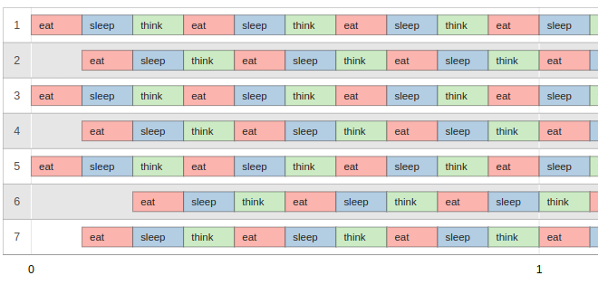

<div align="center">
<h1>42 - Philosophers</h1>


</br>
</br>

<strong>Philosophers 💭🍴</strong>

<p>
The Philosophers project, explores concurrency and synchronization challenges in programming.  
By simulating the famous <a href="https://en.wikipedia.org/wiki/Dining_philosophers_problem">"Dining Philosophers Problem"</a>, it highlights resource-sharing management using threads and processes.
</p>

</br>

<p><a href="https://github.com/MathysCogne/42_Philosophers/blob/main/subject/en.subject.pdf"><strong>Read the Subject</strong></a></p>


</div>

</br>

## Features

</br>

### Mandatory: Threads and Mutexes

- **Shared resource management**: Mutexes are implemented to synchronize access to forks.  
- **Multithreaded simulation**: Each philosopher runs in a separate thread.  
- **State monitoring**: Tracks elapsed time to detect philosophers dying of hunger.

</br>

### Bonus: Processes and Semaphores

- **Multiprocess simulation**: Philosophers are implemented as independent processes.  
- **Synchronization with semaphores**: Efficient management of resources to prevent access conflicts.  
- **Centralized monitoring**: A parent process monitors end conditions and philosopher deaths.

</br>


</br>

## Problematique

The main challenge is managing shared resources (forks) between philosophers while preventing deadlocks and ensuring accurate death detection.

</br>

### Threads and Mutexes:

The thread version focuses on proper mutex locking to share forks between philosophers. Each fork is protected by a mutex to prevent simultaneous use. The challenge lies in deadlock prevention and accurate timestamp monitoring while philosophers alternate between eating, sleeping, and thinking cycles.

</br>

### Processes and Semaphores:

The process version tackles the same challenge using separate processes and semaphores for synchronization. Semaphores manage fork access and ensure atomic operations like printing. The key challenge is maintaining effective inter-process communication while monitoring philosopher states from a parent process.

</br>




## Usage

</br>

```bash
# Compilation
make

# Run the mandatory version (threads and mutexes)
./philo [nb_philosophers] [time_to_die] [time_to_eat] [time_to_sleep] [nb_times_each_philosopher_must_eat (optional)]

# Run the bonus version (processes and semaphores)
./philo_bonus [nb_philosophers] [time_to_die] [time_to_eat] [time_to_sleep] [nb_times_each_philosopher_must_eat (optional)]

```

</br>

## Disclaimer
> At 42 School, most projects must comply with the [Norm](https://github.com/42School/norminette/blob/master/pdf/en.norm.pdf).

</br>